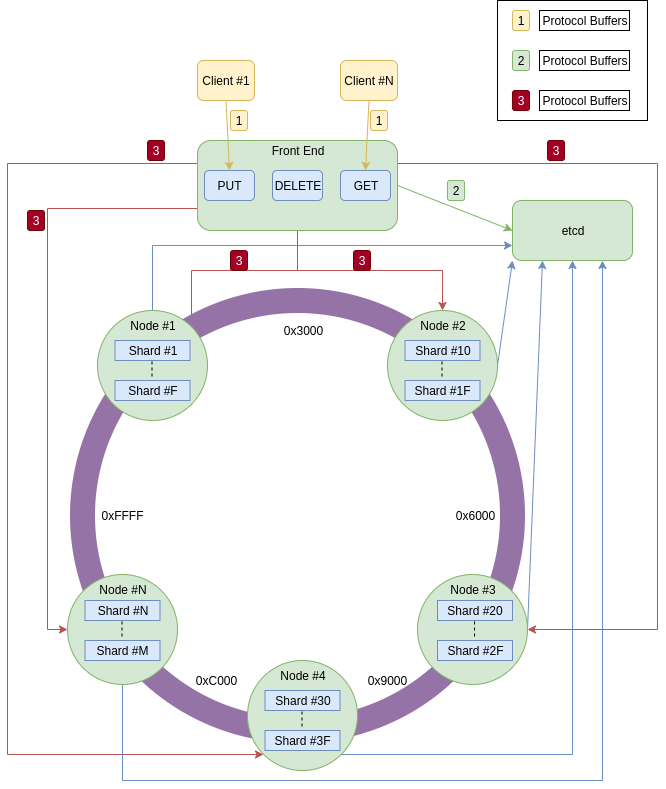

# r_db  
A distributed in memory key-value database. This is a toy database implemented as a learning project.

## Outline

 - [X] **RPC** (gRPC ~~Avro?~~ ~~Thrift?~~)
 - [ ] **Consensus** (etcd ~~Custom Paxos?~~ ~~Custom Raft?~~ ~~Zookeeper?~~)
 - [X] **Storage** (~~B-tree Map?~~ Google's Swisstable (Turns out std::HashMap is an implementation of it) && Custom Lock Free Wrapper)
 - [ ] **API** (RPC? ~~REST?~~)
 - [ ] **Automatic Node Discovery** (etcd? Zookeeper? Kubernetes?)
 - [ ] **Orchestration** (Kubernetes?)
 - [ ] **Client**
 - [ ] **Replication**
 - [ ] **Sharding**
 - [ ] **Autoscaling**
 - [ ] **Compression**
 - [ ] **Benchmarks**
 - [ ] **Custom String with SSO (https://news.ycombinator.com/item?id=18372332)**

## [Initial] High Level Design

### Storage
#### Memory representation
A lock-free* concurrent hash map that will store the data for a single database shard.
It is backed by the std::collections::HashMap which, after Rust 1.36, is a port of
Google's SwissTable so we get that sweet SIMD lookup performance.

Heavily optimized for reads - reads will never block, writes are behind a Mutex.
Instead of using a reader-writer lock which will block the reads while writing, the Shard keeps
2 maps behind atomic pointers. The readers read from one and the writers write to the other one.
After a write the two pointers are swapped and the write is replayed to she stale map.

The main difficulty is keeping track of all readers that have already dereferenced a pointer to the other map.
To solve this every Reader increments an Atomic counter when it dereferences the pointer -> reads -> decrements the counter.
The writer swaps the two pointers and then waits for the counter for the swapped map to get to 0.
Then it knows that there is no one else using the map and the writes can be applied.

Important disadvantage is that all data is stored twice. 'Tis the cost of performance.

## Useful Materials
* https://www.confluent.io/blog/distributed-consensus-reloaded-apache-zookeeper-and-replication-in-kafka/
