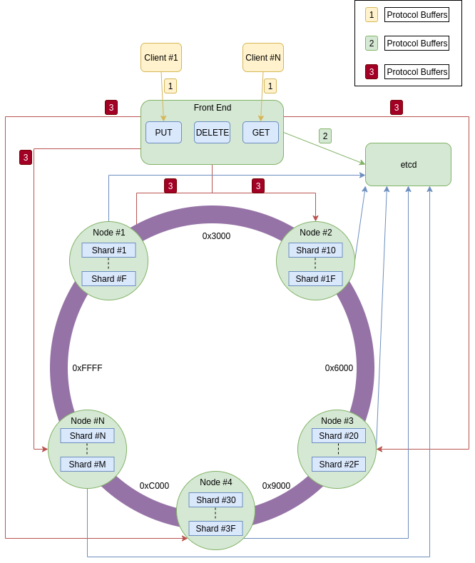

# r_db  
A distributed in memory key-value database. This is a toy database implemented as a learning project.

## Outline

 - [ ] **RPC** (gRPC? ~~Avro?~~ ~~Thrift?~~)
 - [ ] **Consensus** (etcd? ~~Paxos?~~ ~~Raft?~~ ~~Zookeeper?~~)
 - [ ] **Storage** (~~B-tree Map?~~ Google's Swisstable? ~~Custom Hash Map?~~)
 - [ ] **API** (RPC? ~~HTTP?~~)
 - [ ] **Automatic Node Discovery** (etcd? Zookeeper? Kubernetes?)
 - [ ] **Orchestration** (Kubernetes?)
 - [ ] **Client**
 - [ ] **Replication**
 - [ ] **Sharding**
 - [ ] **Autoscaling**
 - [ ] **Compression**

## [Initial] High Level Design

### Storage
Atomically swap two maps
* We can have multiple readers. The load of the db is expected to be read heavy.
* Th readers will be super fast. Only read from the hash map and return. This means that the writer won;t have to wait long to swap the maps
